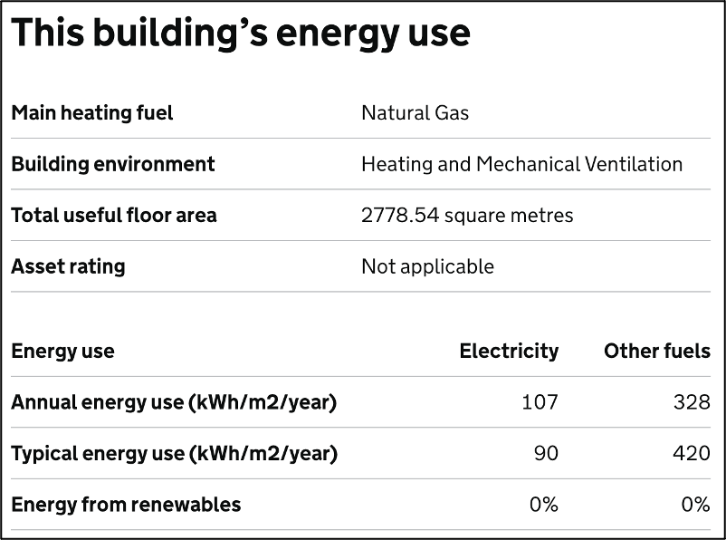

# 01 Fossil Fuels

## Introduction

### Dependencies

* [Department for Business, Energy and Industrial Strategy (BEIS) conversion factors for company reporting](https://www.gov.uk/government/collections/government-conversion-factors-for-company-reporting) (Accessed: 22 July 2022).

### Acknowledgements

Dan Wright1, James Bate 2, Vicky Cooper3, Emma Lee-Jarman1, Stu Meades5, Finn Nightingale1 & Alison Watson6.

1. Kent Community Health NHS Foundation Trust
2. Greener NHS
3. Kent and Medway NHS and Social Care Mental Health Trust 
4. Kent County Council
5. Greener Edge Ltd.
6. Kent and Medway Integrated Care Board

### To do list

* Fossils fuels: Liquid fuels RC, SC and OC
* Fossil fuels: Solid fuels RC, SC and OC

## Methodology

### Definition
Emissions associated with the combustion of any gaseous, liquid, and solid fossil fuels at owned sites and tenanted sites where the reporter holds billing responsibility to the energy supplier.

### Data map

| Description of data available  | Reduced calculation [RC]  | Standard calculation [SC] | Optimal calculation [OC] |
| ------------------------------ |:---:| :---:| :---:|
| Modelled energy consumption | X |  |  |
| Monitored annual consumption, ≥11% estimated (kWh) |  | X |  |
| Monitored annual consumption, ≤10% estimated (kWh) |  |  | X |

### Calculations: Natural gas

**Reduced calculation**

*Equation 1.1* The RC approach for natural gas consumption.

$$ 
\frac{\left( \text{ModCon} \times \text{A} \right) \times \text{Fac}}
{1000} = \text{tCO}_2\text{e} \text{ [RC]}
$$

Where:
* ModCon = Value of modelled annual energy use (kWh/m2) from the relevant Display Energy Certificate.
* A = Value of total useful floor area (m2) from the relevant Display Energy Certificate.
* Fac = Carbon factor assigned to the fuel by the relevant BEIS carbon factor database publication.

**Standard calculation**

*Equation 1.2* The SC approach for natural gas consumption.

$$ 
\frac{\text{EstMonCon} \times \text{Fac}}
{1000} = \text{tCO}_2\text{e} \text{ [SC]}
$$

Where:
* EstMonCon = Value of monitored annual energy use (kWh) where ≥11% of data are estimated.
* Fac = Carbon factor assigned to the fuel by the relevant BEIS carbon factor database publication.  

**Optimal calculation**

*Equation 1.3* The OC approach for natural gas consumption.

$$ 
\frac{\text{MonCon} \times \text{Fac}}
{1000} = \text{tCO}_2\text{e} \text{ [OC]}
$$

Where:
* MonCon = Value of monitored annual energy use (kWh) where ≤10% of data are estimated.
* Fac = Carbon factor assigned to the fuel by the relevant DEFRA or BEIS carbon factor database publication.  

### Examples

**Reduced Data Calculation**

Stu sources the Display Energy Certification (DEC) for the building they are interested in. Using information from the Building Energy Use figure, Stu multiplies the annual energy use of *other fuels* (328) by the *total useful floor area* for the building (2778.54). The calculated annual total consumption (911,361.12) is presented in kWh. 

By using the [BEIS Conversion Factors dataset for the year they are interested in (2019)](https://www.gov.uk/government/publications/greenhouse-gas-reporting-conversion-factors-2019), Stu is able to source a value for emissions per kWh of natural gas use assuming gross calorific value (0.18385kgCO2e/kWh). Stu wants to report in tonnes, therefore divides the sum by 1,000 and then rounds to two decimal places. Along with adding their units (tCO2e), Stu adds the [RC] tag to support transparency around how this figure was calculated. The final value added to Stu’s report on emissions associated with natural gas consumption is 167.55tCO2e [RC].

*Equation 1.4* A worked example of an RDC calculation of emissions associated with natural gas consumption.

$$ 
\frac{\left( 328 \times 2778.54 \right) \times 0.18385}
{1000} = 167.55\text{tCO}_2\text{e} \text{ [RC]}
$$

*Figure 1.1* Example of data sourced from a Display Energy Certificate.

**Standard Calculation**

Julia received confirmation from her energy supplier that the site she was interested in used 100,000kWh of natural gas over the course of a year. The supplier also indicated that for the four months preceding the end of the period being assessed were estimated meter reads (Figure 1.2). Therefore, it was suggested that 33% of the data underlying the period total consumption were estimated, and it was necessary to use the Standard Calculation methodology.

By using the BEIS Conversion Factors dataset for the year she is interested in (2019), Julia was able to source a value for emissions per kWh of natural gas use, assuming gross calorific value (0.18385kgCO2e/kWh). Julia wanted to report in tonnes, therefore divided the sum by 1,000. This value was then rounded to 2 decimal places.  Along with adding her units (tCO2e), Julia made sure to add the [SC] tag to support transparency around how this figure was calculated. The final value added to Julia’s annual report was 18.39tCO2e [SC].

*Equation 1.5* A worked example of an RDC calculation of emissions associated with natural gas consumption.

$$ 
\frac{100000 \times 0.18385}
{1000} = 18.39\text{tCO}_2\text{e} \text{ [SC]}
$$

*Figure 1.2* A visualisation of actual and estimated gas consumption.

**Optimal Calculation**

Jo received confirmation from their energy supplier that the site they were interested in used 200,000kWh of natural gas over the course of a year. The supplier provided access to data from an installed Automated Meter Reader (AMR) and Jo was able to spot four weeks where no gas was being consumed unexpectedly. As such, data were missing for four weeks of a total 48 (for sake of this example), equalling 8.33% of estimated or missing data and 91.67% of verified or intact data. It was therefore possible to use the Optimal Calculation methodology.

By using the BEIS Conversion Factors dataset for the year she is interested in (2019), Jo was able to source a value for emissions per kWh of natural gas use, assuming gross calorific value (0.18385kgCO2e/kWh). Jo wanted to report in tonnes, therefore divided the sum by 1,000. This value was then rounded to 2 decimal places. Along with adding their units (tCO2e), Jo made sure to add the [OC] tag to support transparency around how this figure was calculated. The final value added to Jo’s annual report was 36.77tCO2e [OC].

*Equation 1.6* A worked example of an RDC calculation of emissions associated with natural gas consumption.

$$ 
\frac{200000 \times 0.18385}
{1000} = 36.77\text{tCO}_2\text{e} \text{ [OC]}
$$

*Figure 1.3* A visualisation of actual and estimated gas consumption split per week (simplified to 48 weeks across 12 months for demonstration purposes).

