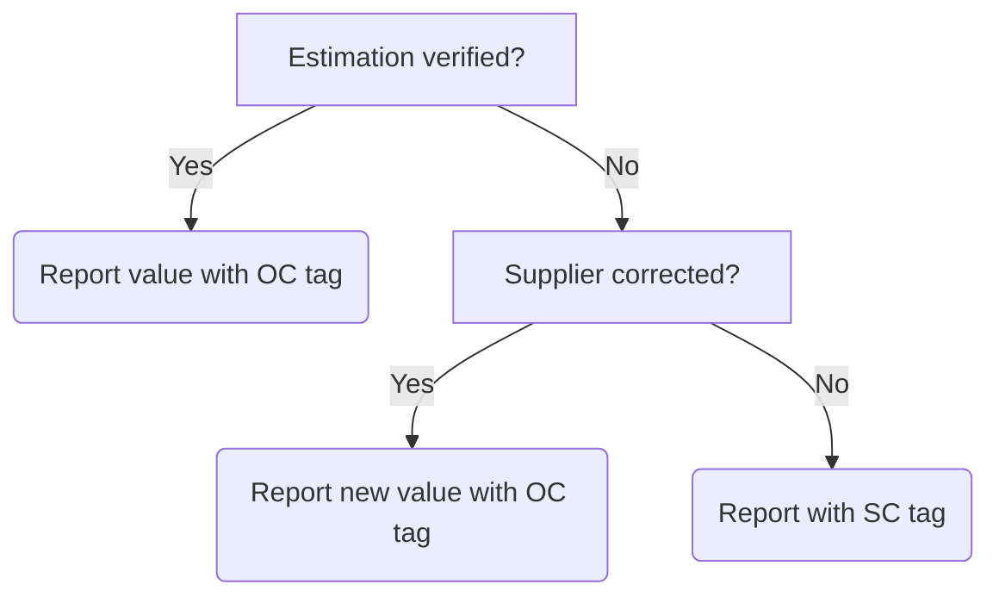

# 11 Medical devices

  <a href="#dependencies">Dependencies</a> •
  <a href="#definition">Definition</a> •
  <a href="#methodology">Methodology</a> •
  <a href="#examples">Examples</a>

## Dependencies

* [Official statistics: UK and England's carbon footprint to 2019 - UK full dataset 1990 - 2019, including conversion factors by SIC code (Department for Environment, Food and Rural Affairs, 2022)](https://www.gov.uk/government/statistics/uks-carbon-footprint) (Accessed 27 December 2022)
* [Find and update company information (Companies House, 2022)](https://find-and-update.company-information.service.gov.uk/) (Accessed 30 December 2022)

## Definition

Emissions associated with the manufacture, operation and disposal of medical devices integral to the diagnosis, treatment, support and care of patients.

## Methodology

**Data map**

| Description of data available  | Reduced calculation [RC]  | Standard calculation [SC] | Optimal Calculation [OC] |
| ------------------------------ |:---:| :---:| :---:|
| Per category purchasing (£) | X |  |  |
| Per supplier purchasing (£) |  | X |  |
| Supplier verification or correction |  |  | X |

**Reduced calculation: Medical devices**

*Equation 11.1* The RC approach for calculating emissions associated with procurement of medical devices.

$$\frac{\left( \text{MedDev1Spend} \times \text{MedDev1Factor} \right) + \left( \text{MedDev2Spend} \times \text{MedDev2Factor} \right) ...}
{1000} = \text{tCO}_2\text{e} \text{ [RC]}$$

Where:
* MedDev*n*Spend = The spend on an element (e.g. x-ray machine purchase) mapped to the theme of medical devices (£).
* MedDev*n*Factor = The weighting assigned to the element through the Standard Industrial Code (SIC) multipliers tab in the relevant [DEFRA emissions dataset](https://www.gov.uk/government/statistics/uks-carbon-footprint) mapped to the theme of medical devices (kgCO2e/£). 

**Standard calculation: Medical devices**

*Equation 11.2* The SC approach for calculating emissions associated with procurement of medical devices.

$$ 
\frac{\left( \text{MedDevSupplier1Spend} \times \text{MedDevSupplier1Factor} \right) + \left( \text{MedDevSupplier2Spend} \times \text{MedDevSupplier2Factor} \right) ...}
{1000} = \text{tCO}_2\text{e} \text{ [RC]}
$$

Where:
* MedDevSupplier*n*Spend = The spend per supplier with an assigned Standard Industrial Code (SIC) mapped to the theme of medical devices (£).
* MedDevSupplier*n*Factor = The weighting assigned to the element through the Standard Industrial Code (SIC) multipliers tab in the relevant [DEFRA emissions dataset](https://www.gov.uk/government/statistics/uks-carbon-footprint) mapped to the theme of medical devices (kgCO2e/£). 

**Optimal calculation: Medical devices**

See the <a href="#examples">example</a> for optimal calculation of emissions associated with procurement of medical devices in collaboration with suppliers.

## Examples

**Reduced calculation: Medical devices**

Edgar requests purchasing records for the period he is interested from his finance or procurement colleagues. The records shared are, as is often the case, split into descriptive accounting themes (e.g. £3,400.00 spend on *dental consumables*). Edgar uses the Standard Industrial Code (SIC) multipliers tab in the relevant [DEFRA emissions dataset](https://www.gov.uk/government/statistics/uks-carbon-footprint) to map this descriptor to the most relevant category to describe the destination of the spend (e.g. *Manufacture of medical dental instruments and suppliers*). Then, Edgar assigns a relevant Greener NHS theme to support with grouping spend to be included in this assessment (Table 11.1).

*Table 11.1* An example of categorical expenditure accounts annotated with SIC category and Greener NHS theme.
| Descriptor | Total spend (£) | SIC category | Greener NHS theme |
| :--------- | :--- | :--- | :--- |
| Dental consumables | 3,400.00 | Manufacture of medical and dental instruments and supplies | Medical devices |
| Insulin pumps | 20,000.00 | Wholesale of pharmaceutical goods | Medical devices |
| ... | ... | ... | ... |

Edgar uses the SIC weightings associated with the *manufacture of medical and dental instruments and supplies* (0.725kgCO2e/£) and *wholesale of pharmaceutical goods* (0.377kgCO2e/£) and multiplies the spends as relevant. In this example, we will assume only two spends were associated with medical devices. Edgar wants to report in tonnes, therefore divides the sum by 1,000 and rounds to two decimal places. Along with adding his units (tCO2e), Edgar adds the [RC] tag to support transparency around how this figure was calculated. The final value added to Edgar's report on emissions associated with procurement of medical devices is 22.47tCO2e [RC].

*Equation 11.4* A worked example of calculating emissions associated with procurement of medical devices using an RC approach.

$$\frac{\left( \text{3400} \times \text{0.725} \right) + \left( \text{20000} \times \text{0.377} \right)}
{1000} = 22.47 \text{tCO}_2\text{e} \text{ [RC]}$$

**Standard calculation: Medical devices**

Juno requests purchasing records for the period they are interested from their finance or procurement colleagues. The records shared are split into spend per supplier (e.g. £7,200.00 spend at *Mick's Dental Bazaar*). Juno uses the [company information finder at Companies House](https://find-and-update.company-information.service.gov.uk/) to locate the SIC code attributed to the supplier. Juno then uses the Standard Industrial Code (SIC) multipliers tab in the relevant [DEFRA emissions dataset](https://www.gov.uk/government/statistics/uks-carbon-footprint) to source the weight associated with the SIC code for that supplier. Juno also assigns a relevant Greener NHS theme to support with grouping spend to be included in this assessment (Table 11.2).

*Table 11.2* An example of per-supplier expenditure accounts annotated with SIC category and Greener NHS theme.
| Supplier name | Total spend (£) | SIC category | Greener NHS theme |
| :--------- | :--- | :--- | :--- |
| Mick's Dental Bazaar | 7,200.00 | Manufacture of medical and dental instruments and supplies | Medical devices |
| InsulinCorp | 50,000.00 | Wholesale of pharmaceutical goods | Medical devices |
| ... | ... | ... | ... |

Juno uses the SIC weightings associated with the *manufacture of medical and dental instruments and supplies* (0.725kgCO2e/£) and *wholesale of pharmaceutical goods* (0.377kgCO2e/£) and multiplies the spends as relevant. In this example, we will assume only two spends were associated with medical devices. Juno wants to report in tonnes, therefore divides the sum by 1,000 and rounds to two decimal places. Along with adding their units (tCO2e), Juno adds the [SC] tag to support transparency around how this figure was calculated. The final value added to Juno's report on emissions associated with procurement of medical devices is 24.07tCO2e [SC].

*Equation 11.5* A worked example of calculating emissions associated with procurement of medical devices using an SC approach.

$$\frac{\left( \text{7200} \times \text{0.725} \right) + \left( \text{50000} \times \text{0.377} \right)}
{1000} = 24.07 \text{tCO}_2\text{e} \text{ [RC]}$$

**Optimal calculation: Medical devices**

> To achieve a denotation an optimal calculation of emissions associated with the procurement of medical devices, it is necessary to obtain verified impacts from suppliers. The estimated value(s) acquired through the standard calculation approach offers a valuable means to initiate and progress conversations with suppliers with the objective of obtaining a more accurate footprint associated with purchasing from a supplier. Should a supplier be unable to verify, this offers opportunities for introduction of specific key performance indicators in future contract negotations or re-tenders for services and/or products.

Sandra follows the standard calculation approach to acquire a value for emissions associated with spend on medical devices at a supplier called *Mick's Dental Bazaar* (10.2tCO2e). Sandra works with her procurement colleagues to understand the nature of the purchase, such as whether there is a contract in place, and if so, if there may be any pertinent key performance indicators and if the contract may be upcoming for renewal.

With support as necessary from her procurement colleagues, Sandra contacts the account manager, or relevant contact, at *Mick's Dental Bazaar* to share the findings of her emission estimation with the objective of either obtaining verification of that estimate or replacing the estimate with a more accurate value direct from the supplier. Lines of enquiry could include:

* Can *Mick's Dental Bazaar* verify that 10.2tCO2e is a reasonable estimation for emissions associated with the spend?
* Can *Mick's Dental Bazaar* provide a more accurate estimation of estimation for emissions associated with the spend?
* If *Mick's Dental Bazaar* cannot verify or correct the estimate, when could a supplier-led footprint be expected?

In Sandra's case, she received a reply from *Mick's Dental Bazaar* stating that the estimate could neither be confirmed nor rejected. Following Sandra's request for improved data, *Mick's Dental Bazaar* shared information contained in an emissions footprint analysis calculated across their whole business. In addition to requesting further information around the categories included in the assessment undertaken by *Mick's Dental Bazaar* (e.g. was this a full scope analysis or restricted to scopes one and two?), Sandra requests a value for total income over the period, estimating that this could be one way to apportion impact based on spend (Equation 11.6). 

*Equation 11.6* An approach to estimating percentage of supplier emissions that can be apportioned to a spend.

$$\frac{\left( \text{MedDevSupplier1Foot} \div \text{MedDevSupplier1FullInc} \right) \times \text{MedDevSupplier1Spend}}
{1000} = \text{tCO}_2\text{e} \text{ [OC]}$$

Where:
* MedDevSupplier*n*Foot = The supplier provided full business footprint (kgCO2e).
* MedDevSupplier*n*FullInc = The supplier provided total income (£)
* MedDevSupplier*n*Spend = The spend per supplier with an assigned SIC mapped to the theme of medical devices (£).

Sandra divides the *Mick's Dental Bazaar* emissions footprint (40,000kgCO2e) by their gross income (£1,000,000) and then multiplies this by her spend with that supplier (£20,000). Sandra wants to report in tonnes, therefore divides the sum by 1,000 and rounds to two decimal places. Along with adding her units (tCO2e), Sandra adds the [OC] tag to support transparency around how this figure was calculated. The final value added to Sandra's report on emissions associated with procurement of medical devices, from this supplier, is 0.8tCO2e [OC].

*Equation 11.7* A worked example of apportioned emissions calculated from a total supplier impact.

$$\frac{\left( 40000 \div 1000000 \right) \times 20000}
{1000} = 0.8 \text{tCO}_2\text{e} \text{ [OC]}$$

A simplified flowchart is featured in Fig 11.1 to help visualise the situations in which featuring an [OC] tag could be justified.

*Figure 11.1* A visualisation of a decision flow around calculation justification following communication and response, or lack thereof, from supplier in question.
