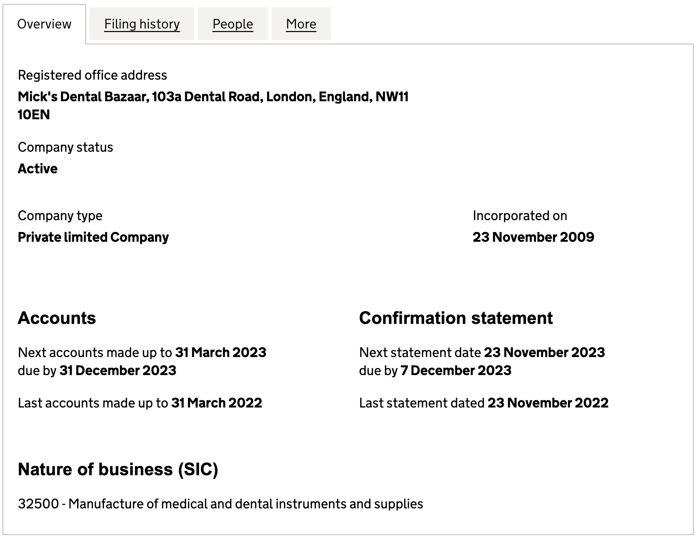
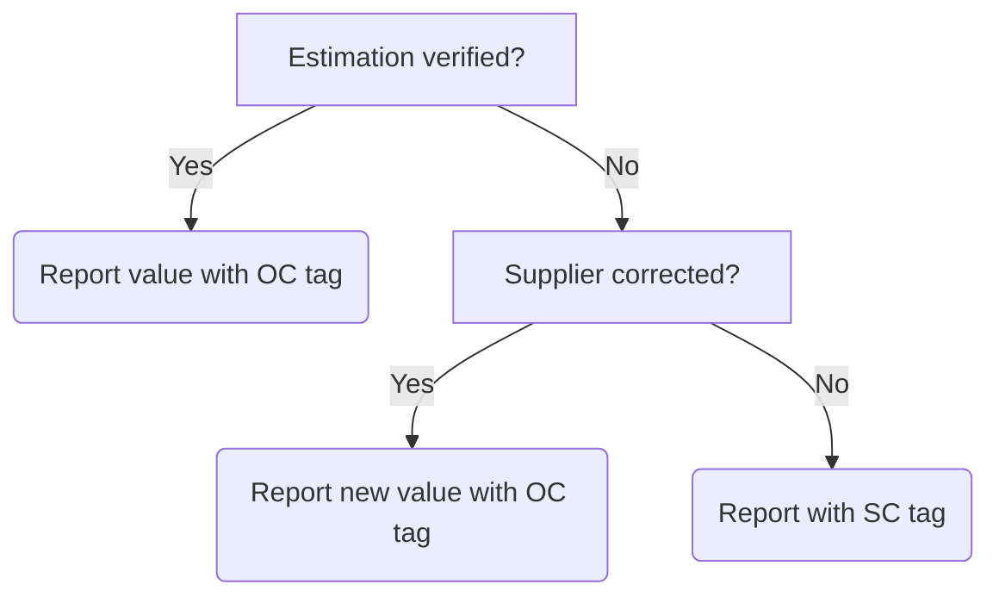

# 13 Business services

  <a href="#dependencies">Dependencies</a> •
  <a href="#definition">Definition</a> •
  <a href="#methodology">Methodology</a> •
  <a href="#examples">Examples</a>

## Dependencies

* [Official statistics: UK and England's carbon footprint to 2019 - UK full dataset 1990 - 2019, including conversion factors by SIC code (Department for Environment, Food and Rural Affairs, 2022)](https://www.gov.uk/government/statistics/uks-carbon-footprint) (Accessed 27 December 2022)
* [Find and update company information (Companies House, 2022)](https://find-and-update.company-information.service.gov.uk/) (Accessed 30 December 2022)

## Definition

Emissions associated with the provision of services which enable non-clinical business functions such as consultancy, software access and operational support.

## Methodology

**Data map**

| Description of data available  | Reduced calculation [RC]  | Standard calculation [SC] | Optimal Calculation [OC] |
| ------------------------------ |:---:| :---:| :---:|
| Per category purchasing (£) | X |  |  |
| Per supplier purchasing (£) |  | X |  |
| Supplier verification or correction |  |  | X |

**Reduced calculation: Business services**

*Equation 13.1* The RC approach for calculating emissions associated with procurement of business services.

$$\frac{\left( \text{Element1Spend} \times \text{Element1Factor} \right) + \left( \text{Element2Spend} \times \text{Element2Factor} \right) ...}
{1000} = \text{tCO}_2\text{e} \text{ [RC]}$$

Where:
* Element*n*Spend = The spend on a relevant element (e.g. hire of x-ray machine) mapped by the assessor (£).
* Element*n*Factor = The weighting assigned through the Standard Industrial Code (SIC) multipliers tab in the relevant [DEFRA emissions dataset](https://www.gov.uk/government/statistics/uks-carbon-footprint) mapped by the assessor (kgCO2e/£). 

**Standard calculation: Business services**

*Equation 13.2* The SC approach for calculating emissions associated with procurement of business services.

$$ 
\frac{\left( \text{Supplier1Spend} \times \text{Supplier1Factor} \right) + \left( \text{Supplier2Spend} \times \text{Supplier2Factor} \right) ...}
{1000} = \text{tCO}_2\text{e} \text{ [RC]}
$$

Where:
* Supplier*n*Spend = The spend per supplier with an assigned Standard Industrial Code (SIC) mapped to the theme of business services (£).
* Supplier*n*Factor = The weighting assigned through the Standard Industrial Code (SIC) multipliers tab in the relevant [DEFRA emissions dataset](https://www.gov.uk/government/statistics/uks-carbon-footprint) mapped by the CompaniesHouse (kgCO2e/£). 

**Optimal calculation: Business services**

See the <a href="#examples">example</a> for optimal calculation of emissions associated with procurement of business services in collaboration with suppliers.

## Examples

**Reduced calculation: Business services**

Zack requests purchasing records for the period he is interested from his finance or procurement colleagues. The records shared are, as is often the case, split into descriptive accounting themes (e.g. £3,400.00 spend on *general couriers*). Zack uses the Standard Industrial Code (SIC) multipliers tab in the relevant [DEFRA emissions dataset](https://www.gov.uk/government/statistics/uks-carbon-footprint) to map this descriptor to the most relevant category to describe the destination of the spend (e.g. *postal and courier services*). Then, Zack assigns a relevant Greener NHS theme to support with grouping spend to be included in this assessment (Table 13.1).

*Table 13.1* An example of categorical expenditure accounts annotated with SIC category and Greener NHS theme.
| Descriptor | Total spend (£) | SIC category | Greener NHS theme |
| :--------- | :--- | :--- | :--- |
| Tax accountants | 3,400.00 | Tax consultancy | Business services |
| Management consultants | 20,000.00 | Management consultancy activities other than financial management |
| ... | ... | ... | ... |

Zack uses the SIC weightings associated with the *postal and courier services* (0.145kgCO2e/£) and *business services by road* (0.104kgCO2e/£) and multiplies the element spends as relevant. In this example, we will assume that only two spends were associated with business services. Zack wants to report in tonnes, therefore divides the sum by 1,000 and rounds to two decimal places (Equation 13.3). Along with adding his units (tCO2e), Zack adds the [RC] tag to support transparency around how this figure was calculated. The final value added to Zack's report on emissions associated with procurement of business services services is 2.57tCO2e [RC].

*Equation 13.3* A worked example of calculating emissions associated with procurement of business services services using an RC approach.

$$\frac{\left( \text{3400} \times \text{0.145} \right) + \left( \text{20000} \times \text{0.104} \right)}
{1000} = 2.57 \text{tCO}_2\text{e} \text{ [RC]}$$

**Standard calculation: Business services**

Alex requests purchasing records for the period they are interested from their finance or procurement colleagues. The records shared are split into spend per supplier (e.g. £7,200.00 spend at *Andy's Accountants*). Alex uses the [company information finder at Companies House](https://find-and-update.company-information.service.gov.uk/) to locate the SIC code attributed to the supplier (Fig 13.1). 

*Figure 13.1* An example of the result from searching for the fictious company 'Mick's Dental Bazaar'. The SIC code relevant to the business is featured in the *Nature of business (SIC)* field.

Alex then uses the Standard Industrial Code (SIC) multipliers tab in the relevant [DEFRA emissions dataset](https://www.gov.uk/government/statistics/uks-carbon-footprint) to source the emissions weighting associated with the SIC code for that supplier. Alex also assigns a relevant Greener NHS theme to support with grouping spend to be included in this assessment (Table 13.2).

*Table 13.2* An example of per-supplier expenditure accounts annotated with SIC category and Greener NHS theme.
| Supplier name | Total spend (£) | SIC category | Greener NHS theme |
| :--------- | :--- | :--- | :--- |
| Andy's Accountants | 7,200.00 | Tax consultancy | Business services |
| Consultio-Consultius | 50,000.00 | Management consultancy activities other than financial management | Business services |
| ... | ... | ... | ... |

Alex uses the SIC weightings associated with *tax consultancy* (0.145kgCO2e/£) and *management consultancy activities other than financial management* (0.104kgCO2e/£) and multiplies the spends with Andy's Accountants and Consultio-Consultius as relevant. In this example, we will assume only two spends were associated with business services. Alex wants to report in tonnes, therefore divides the sum by 1,000 and rounds to two decimal places (Equation 13.4). Along with adding their units (tCO2e), Alex adds the [SC] tag to support transparency around how this figure was calculated. The final value added to Alex's report on emissions associated with procurement of business services is 6.24tCO2e [SC].

*Equation 13.4* A worked example of calculating emissions associated with procurement of business services using an SC approach.

$$\frac{\left( \text{7200} \times \text{0.145} \right) + \left( \text{50000} \times \text{0.104} \right)}
{1000} = 6.24 \text{tCO}_2\text{e} \text{ [SC]}$$

**Optimal calculation: Business services**

> To achieve an optimal calculation of emissions associated with the procurement of business services, it is necessary to obtain verified impacts from suppliers. The estimated value(s) acquired through the standard calculation approach offers a valuable means to initiate and progress conversations with suppliers with the objective of obtaining a more accurate footprint associated with purchasing from a supplier. Should a supplier be unable to verify, this offers opportunities for introduction of specific key performance indicators in future contract negotations or re-tenders for services and/or products.

Ashton follows the standard calculation approach to acquire a value for emissions associated with spend on business services at a supplier called *Andy's Accountants* (10.2tCO2e). Ashton works with her procurement colleagues to understand the nature of the purchase, such as whether there is a contract in place, and if so, if there may be any pertinent key performance indicators and if the contract may be upcoming for renewal.

With support as necessary from her procurement colleagues, Ashton contacts the account manager, or relevant contact, at *Andy's Accountants* to share the findings of her emission estimation with the objective of either obtaining verification of that estimate or replacing the estimate with a more accurate value direct from the supplier. Lines of enquiry could include:

* Can *Andy's Accountants* verify that 10.2tCO2e is a reasonable estimation for emissions associated with the spend?
* Can *Andy's Accountants* provide a more accurate estimation of estimation for emissions associated with the spend?
* If *Andy's Accountants* cannot verify or correct the estimate, when could a supplier-led footprint be expected?

In Ashton's case, she received a reply from *Andy's Accountants* stating that the estimate could neither be confirmed nor rejected. Following Ashton's request for improved data, *Andy's Accountants* shared information contained in an emissions footprint analysis calculated across their whole business. In addition to requesting further information around the categories included in the assessment undertaken by *Andy's Accountants* (e.g. was this a full scope analysis or restricted to scopes one and two?), Ashton requests a value for total income over the period, estimating that this could be one way to apportion impact based on spend (Equation 13.5). 

*Equation 13.5* An approach to estimating percentage of supplier emissions that can be apportioned to a spend.

$$\frac{\left( \text{MedDevSupplier1Foot} \div \text{MedDevSupplier1FullInc} \right) \times \text{MedDevSupplier1Spend}}
{1000} = \text{tCO}_2\text{e} \text{ [OC]}$$

Where:
* Supplier*n*Foot = The supplier provided full business footprint (kgCO2e).
* Supplier*n*FullInc = The supplier provided total income (£)
* Supplier*n*Spend = The assesor's spend on the supplier (£).

Ashton divides the *Andy's Accountants* emissions footprint (40,000kgCO2e) by their gross income (£1,000,000) and then multiplies this by her spend with that supplier (£20,000). Ashton wants to report in tonnes, therefore divides the sum by 1,000 and rounds to two decimal places. Along with adding her units (tCO2e), Ashton adds the [OC] tag to support transparency around how this figure was calculated (Equation 13.6). The final value added to Ashton's report on emissions associated with procurement of business services, from this supplier, is 0.8tCO2e [OC].

*Equation 13.6* A worked example of apportioned emissions calculated from a total supplier impact.

$$\frac{\left( 40000 \div 1000000 \right) \times 20000}
{1000} = 0.8 \text{tCO}_2\text{e} \text{ [OC]}$$

A simplified flowchart is featured in Fig 13.2 to help visualise the situations in which featuring an [OC] tag could be justified.

*Figure 13.2* A visualisation of a decision flow around calculation justification following communication and response, or lack thereof, from supplier in question.
