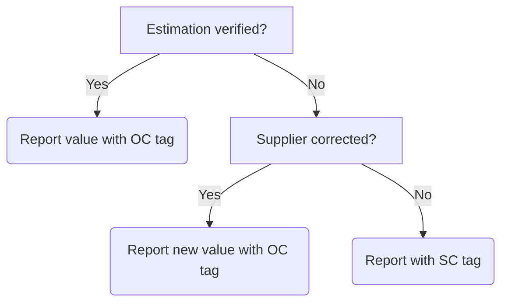

# 15 Manufacturing (products, chemicals, gases)

  <a href="#dependencies">Dependencies</a> •
  <a href="#definition">Definition</a> •
  <a href="#methodology">Methodology</a> •
  <a href="#examples">Examples</a>

## Dependencies

* [Official statistics: UK and England's carbon footprint to 2019 - UK full dataset 1990 - 2019, including conversion factors by SIC code (Department for Environment, Food and Rural Affairs, 2022)](https://www.gov.uk/government/statistics/uks-carbon-footprint) (Accessed 27 December 2022)
* [Find and update company information (Companies House, 2022)](https://find-and-update.company-information.service.gov.uk/) (Accessed 30 December 2022)

## Definition

Emissions associated with the process of construction provisioned by the reporting party including the manufacture of building materials.

## Methodology

**Data map**

| Description of data available  | Reduced calculation [RC]  | Standard calculation [SC] | Optimal Calculation [OC] |
| ------------------------------ |:---:| :---:| :---:|
| Per category purchasing (£) | X |  |  |
| Per supplier purchasing (£) |  | X |  |
| Supplier verification or correction |  |  | X |

**Reduced calculation: Construction**

*Equation 14.1* The RC approach for calculating emissions associated with procurement of construction.

$$\frac{\left( \text{Element1Spend} \times \text{Element1Factor} \right) + \left( \text{Element2Spend} \times \text{Element2Factor} \right) ...}
{1000} = \text{tCO}_2\text{e} \text{ [RC]}$$

Where:
* Element*n*Spend = The spend on a relevant element (e.g. extension of a hospital) mapped by the assessor (£).
* Element*n*Factor = The weighting assigned through the Standard Industrial Code (SIC) multipliers tab in the relevant [DEFRA emissions dataset](https://www.gov.uk/government/statistics/uks-carbon-footprint) mapped by the assessor (kgCO2e/£). 

**Standard calculation: Construction**

*Equation 14.2* The SC approach for calculating emissions associated with procurement of construction.

$$ 
\frac{\left( \text{Supplier1Spend} \times \text{Supplier1Factor} \right) + \left( \text{Supplier2Spend} \times \text{Supplier2Factor} \right) ...}
{1000} = \text{tCO}_2\text{e} \text{ [SC]}
$$

Where:
* Supplier*n*Spend = The spend per supplier with an assigned Standard Industrial Code (SIC) mapped to the theme of construction (£).
* Supplier*n*Factor = The weighting associated with the the Standard Industrial Code (SIC) assigned by Companies House as defined in the multipliers tab in the relevant [DEFRA emissions dataset](https://www.gov.uk/government/statistics/uks-carbon-footprint) (kgCO2e/£). 

**Optimal calculation: Construction**

See the <a href="#examples">example</a> for optimal calculation of emissions associated with procurement of construction in collaboration with suppliers.

## Examples

**Reduced calculation: Construction**

Ivan requests purchasing records for the period he is interested from his finance or procurement colleagues. The records shared are, as is often the case, split into descriptive accounting themes (e.g. £300,400.00 spend on *new administration building*). Ivan uses the Standard Industrial Code (SIC) multipliers tab in the relevant [DEFRA emissions dataset](https://www.gov.uk/government/statistics/uks-carbon-footprint) to map this descriptor to the most relevant category to describe the destination of the spend (e.g. *construction of commercial buildings*). Then, Ivan assigns a relevant Greener NHS theme to support with grouping spend to be included in this assessment (Table 14.1).

*Table 14.1* An example of categorical expenditure accounts annotated with SIC category and Greener NHS theme.
| Descriptor | Total spend (£) | SIC category | Greener NHS theme |
| :--------- | :--- | :--- | :--- |
| Builders | 300,400.00 | Construction of commercial buildings | Construction |
| Building supplies | 20,000.00 | Wholesale of wood, construction materials and sanitary equipment | Construction | 
| ... | ... | ... | ... |

Ivan uses the SIC weightings associated with the *construction of commercial buildings* (0.240kgCO2e/£) and *wholesale of wood, construction materials and sanitary equipment* (0.377kgCO2e/£) and multiplies the element spends as relevant. In this example, we will assume that only two spends were associated with construction. Ivan wants to report in tonnes, therefore divides the sum by 1,000 and rounds to two decimal places (Equation 14.3). Along with adding his units (tCO2e), Ivan adds the [RC] tag to support transparency around how this figure was calculated. The final value added to Ivan's report on emissions associated with procurement of construction services is 79.64tCO2e [RC].

*Equation 14.3* A worked example of calculating emissions associated with procurement of construction services using an RC approach.

$$\frac{\left( \text{300400} \times \text{0.240} \right) + \left( \text{20000} \times \text{0.377} \right)}
{1000} = 79.64 \text{tCO}_2\text{e} \text{ [RC]}$$

**Standard calculation: Construction**

Max requests purchasing records for the period they are interested from their finance or procurement colleagues. The records shared are split into spend per supplier (e.g. £7,200.00 spend at *Bill D'Buildings Ltd*). Max uses the [company information finder at Companies House](https://find-and-update.company-information.service.gov.uk/) to locate the SIC code attributed to the supplier (Fig 14.1). 

*Figure 14.1* An example of the result from searching for the fictious company 'Mick's Dental Bazaar'. The SIC code relevant to the business is featured in the *Nature of business (SIC)* field.

Max then uses the Standard Industrial Code (SIC) multipliers tab in the relevant [DEFRA emissions dataset](https://www.gov.uk/government/statistics/uks-carbon-footprint) to source the emissions weighting associated with the SIC code for that supplier. Max also assigns a relevant Greener NHS theme to support with grouping spend to be included in this assessment (Table 14.2).

*Table 14.2* An example of per-supplier expenditure accounts annotated with SIC category and Greener NHS theme.
| Supplier name | Total spend (£) | SIC category | Greener NHS theme |
| :--------- | :--- | :--- | :--- |
| Bill D'Buildings Ltd | 7,200.00 | Construction of commercial buildings | Construction |
| Bob's Building Supplies | 50,000.00 |Wholesale of wood, construction materials and sanitary equipment | Construction |
| ... | ... | ... | ... |

Max uses the SIC weightings associated with the *construction of commercial buildings* (0.240kgCO2e/£) and *wholesale of wood, construction materials and sanitary equipment* (0.377kgCO2e/£) and multiplies the spends with *Bill D'Buildings Ltd* and *Bob's Building Supplies* as relevant. In this example, we will assume only two spends were associated with construction. Max wants to report in tonnes, therefore divides the sum by 1,000 and rounds to two decimal places (Equation 14.4). Along with adding their units (tCO2e), Max adds the [SC] tag to support transparency around how this figure was calculated. The final value added to Max's report on emissions associated with procurement of construction is 20.58tCO2e [SC].

*Equation 14.4* A worked example of calculating emissions associated with procurement of construction using an SC approach.

$$\frac{\left( \text{7200} \times \text{0.240} \right) + \left( \text{50000} \times \text{0.377} \right)}
{1000} = 20.58 \text{tCO}_2\text{e} \text{ [SC]}$$

**Optimal calculation: Construction**

> To achieve an optimal calculation of emissions associated with the procurement of construction, it is necessary to obtain verified impacts from suppliers. The estimated value(s) acquired through the standard calculation approach offers a valuable means to initiate and progress conversations with suppliers with the objective of obtaining a more accurate footprint associated with purchasing from a supplier. Should a supplier be unable to verify, this offers opportunities for introduction of specific key performance indicators in future contract negotations or re-tenders for services and/or products.

Lucia follows the standard calculation approach to acquire a value for emissions associated with spend on construction at a supplier called *Bill D'Buildings Ltd* (10.2tCO2e). Lucia works with her procurement colleagues to understand the nature of the purchase, such as whether there is a contract in place, and if so, if there may be any pertinent key performance indicators and if the contract may be upcoming for renewal.

With support as necessary from her procurement colleagues, Lucia contacts the account manager, or relevant contact, at *Bill D'Buildings Ltd* to share the findings of her emission estimation with the objective of either obtaining verification of that estimate or replacing the estimate with a more accurate value direct from the supplier. Lines of enquiry could include:

* Can *Bill D'Buildings Ltd* verify that 10.2tCO2e is a reasonable estimation for emissions associated with the spend?
* Can *Bill D'Buildings Ltd* provide a more accurate estimation of estimation for emissions associated with the spend?
* If *Bill D'Buildings Ltd* cannot verify or correct the estimate, when could a supplier-led footprint be expected?

In Lucia's case, she received a reply from *Bill D'Buildings Ltd* stating that the estimate could neither be confirmed nor rejected. Following Lucia's request for improved data, *Bill D'Buildings Ltd* shared information contained in an emissions footprint analysis calculated across their whole business. In addition to requesting further information around the categories included in the assessment undertaken by *Bill D'Buildings Ltd* (e.g. was this a full scope analysis or restricted to scopes one and two?), Lucia requests a value for total income over the period, estimating that this could be one way to apportion impact based on spend (Equation 14.5). 

*Equation 14.5* An approach to estimating percentage of supplier emissions that can be apportioned to a spend.

$$\frac{\left( \text{MedDevSupplier1Foot} \div \text{MedDevSupplier1FullInc} \right) \times \text{MedDevSupplier1Spend}}
{1000} = \text{tCO}_2\text{e} \text{ [OC]}$$

Where:
* Supplier*n*Foot = The supplier provided full business footprint (kgCO2e).
* Supplier*n*FullInc = The supplier provided total income (£)
* Supplier*n*Spend = The assesor's spend on the supplier (£).

Lucia divides the *Bill D'Buildings Ltd* emissions footprint (40,000kgCO2e) by their gross income (£1,000,000) and then multiplies this by her spend with that supplier (£20,000). Lucia wants to report in tonnes, therefore divides the sum by 1,000 and rounds to two decimal places. Along with adding her units (tCO2e), Lucia adds the [OC] tag to support transparency around how this figure was calculated (Equation 14.6). The final value added to Lucia's report on emissions associated with procurement of construction, from this supplier, is 0.8tCO2e [OC].

*Equation 14.6* A worked example of apportioned emissions calculated from a total supplier impact.

$$\frac{\left( 40000 \div 1000000 \right) \times 20000}
{1000} = 0.8 \text{tCO}_2\text{e} \text{ [OC]}$$

A simplified flowchart is featured in Fig 14.2 to help visualise the situations in which featuring an [OC] tag could be justified.

*Figure 14.2* A visualisation of a decision flow around calculation justification following communication and response, or lack thereof, from supplier in question.
