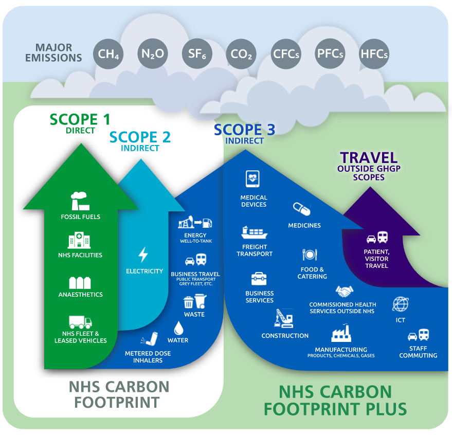

> A transparent, collaborative and evidence-based approach to establishing a standardised means of calculating emissions associated with NHS Carbon Footprint and Carbon Footprint Plus themes set out by the [Greener NHS](https://www.england.nhs.uk/greenernhs/) in October 2020. These documents have been developed by Dr Dan Wright of the Sustainability Team at [Kent Community Health NHS Foundation Trust](https://www.kentcht.nhs.uk/) in collaboration with members of the Kent & Medway Sustainability Impacts and Methodologies Group (KMS-IMG).

<h1 align="center">
   
  
   
  The NHS Emission Quantification Recipe Book
   
</h1>

  <a href="#key-features">Key Features</a> •
  <a href="#how-to-use">How To Use</a> •
  <a href="#credits">Credits</a> •
  <a href="#license">License</a> •
  <a href="#example-report">Example report</a> •
  <a href="#change-log">Change log</a>

## How to use

The files can be downloaded by navigating to the parent folder 'cove-project' and choosing the 'Download ZIP' option from the 'Code' button. Alternatively, the repository can be forked and/or cloned using [Git](https://git-scm.com).

Each module has an individual README for guidance on how to implement via the command line or through a notebook environment:

* Module One: VES API cache creation
* Module Two: Mileage data analysis
* ~~Module Three: Create graphs to visualise the mileage claim data~~ (Coming in v1.1!)
* ~~Module Four: Geospatial visualisation of journeys, destinations and bases~~ (Coming in v1.2!)

Fig 1. A summary of the themes considered to be within scope for reduction to zero by 2040 (NHS Carbon Footprint) and 2045 (NHS Carbon Footprint Plus) published by the [Greener NHS](https://www.england.nhs.uk/greenernhs/a-net-zero-nhs/).

## Emailware

The COVE Tool is [emailware](https://en.wiktionary.org/wiki/emailware). Meaning, if you liked using this tool or it has helped you in any way, please send us an email at <kentcht.sustainability@nhs.net> about anything you'd want to say about this tool. We really appreciate it!

## Credits

This software uses the following packages:

- [Pandas](https://pandas.pydata.org/)
- [Numpy](https://numpy.org/)
- [Plotly](https://pypi.org/project/plotly/)

## You may also like...

- [Driver & Vehicle Standards Agency](https://github.com/dvsa)
- [NHS PyCom](https://github.com/nhs-pycom/nhs.pycom)
- [Kent Community Health NHS Foundation Trust](https://kentcht.nhs.uk)

## License

MIT

## Example report

## Change log

* Context of Vehicle Emissions (COVE) Tool v1.0 - 28 June 2022
  - Initial public release sharing 1) The means of implementation to contextualise mileage claim datasets with the DoT's Vehicle Enquiry Service API, and 2) An approach to wrangling mileage claim data to facilitate contextualisation.